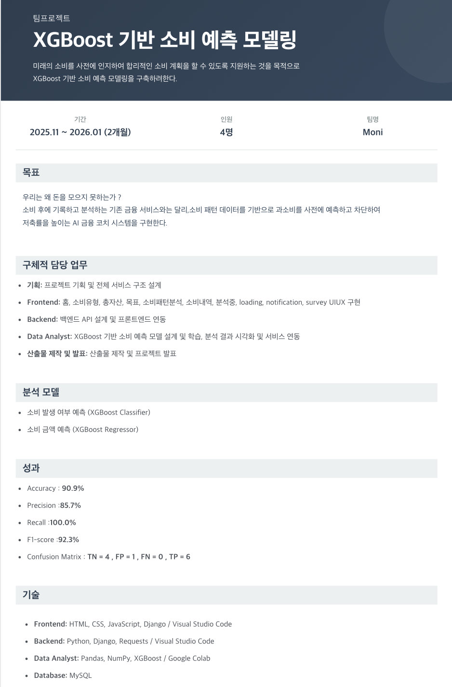

  

## Development Log

 Moni Development Log 

- [Moni-Dev Log](https://www.notion.so/Moni-Development-Log-2e9589dece9f8023a792de7704de834a?source=copy_link)

## 프로젝트 문서

 프로젝트 기획서

- [프로젝트 기획서.pdf](report/프로젝트%20기획서.pdf)

 요구사항 정의서

- [요구사항 정의서.xlsx](report/요구사항%20정의서.xlsx)

 WBS

- [WBS.xlsx](report/WBS.xlsx)

 모델 정의서 & 성능평가서

- [모델 정의서 & 성능평가서.pdf](report/모델%20정의서%20%26%20성능평가서.pdf)

 최종 보고서

- [최종 보고서.pdf](report/최종%20보고서.pdf)

 최종 PPT

- [최종 PPT.pdf](report/최종%20PPT.pdf)

 함수정의서 

- [함수정의서.pdf](report/함수정의서.pdf)

 시연영상 

- [시연영상.pdf](report/시연영상.mp4)

## Moni main Git

 Moni main Git 

- [Moni-git](https://github.com/Sohyeon-Park-git/Moni)

