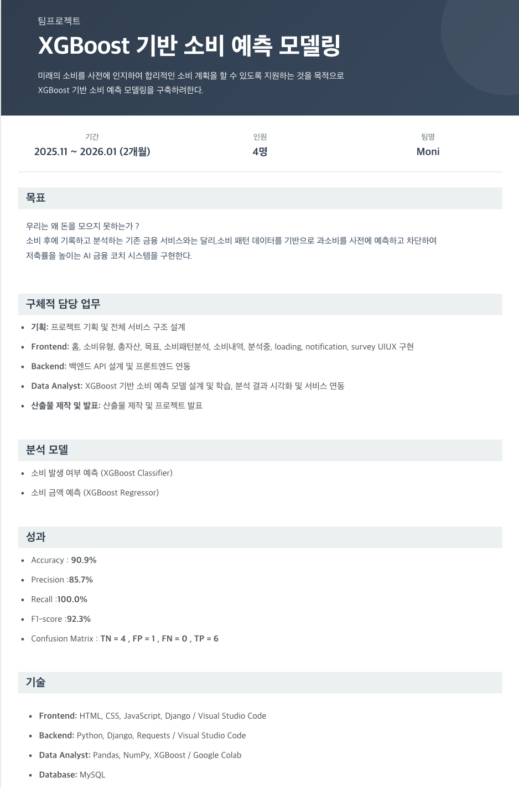

# 소비 행동 패턴 기반 나만의 AI 금융 코치
### XGBoost 기반 소비 예측 모델링

  

### 핵심 내용

- 가상 데이터 기반으로 생성된 약 1년간의 지출 내역을 활용하여 분석을 진행하였다. 단일 사용자 데이터만을 사용했기 때문에 학습 데이터량이 제한적이었고, 이로 인해 소비 패턴의 일반화에는 구조적인 한계가 존재한다.

- 분석 결과, 정기적인 소비 패턴이 뚜렷한 카테고리에서는 비교적 안정적인 예측 성능을 보였다. 반면, 비정기적 과소비 카테고리에서는 과거 고액 지출의 영향으로 예측 금액이 실제보다 과대 추정되는 현상이 발생하였다.

- 따라서, 금액 예측 중심의 알림보다는 XGBoost Classifier 기반의 소비 발생 예측을 활용한 알림 구조가 더 적합하다고 판단하였다. 또한 spend_count와 같은 미래 시점에 알 수 없는 피처를 제거하여 데이터 누수 없는 모델을 구성하였다.

## Development Log

 Moni Development Log 

- [Moni-Dev Log](https://www.notion.so/Moni-Development-Log-2e9589dece9f8023a792de7704de834a?source=copy_link)

## 프로젝트 문서

 프로젝트 기획서

- [프로젝트 기획서.pdf](report/프로젝트%20기획서.pdf)

 요구사항 정의서

- [요구사항 정의서.xlsx](report/요구사항%20정의서.xlsx)

 WBS

- [WBS.xlsx](report/WBS.xlsx)

 모델 정의서 & 성능평가서

- [모델 정의서 & 성능평가서.pdf](report/모델%20정의서%20%26%20성능평가서.pdf)

 최종 보고서

- [최종 보고서.pdf](report/최종%20보고서.pdf)

 최종 PPT

- [최종 PPT.pdf](report/최종%20PPT.pdf)

 함수정의서 

- [함수정의서.pdf](report/함수정의서.pdf)

 시연영상 

- [시연영상.pdf](report/시연영상.mp4)

## Moni main Git

 Moni main Git 

- [Moni-git](https://github.com/Sohyeon-Park-git/Moni)

