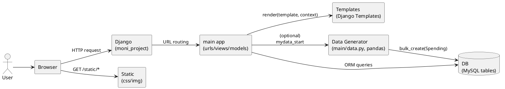
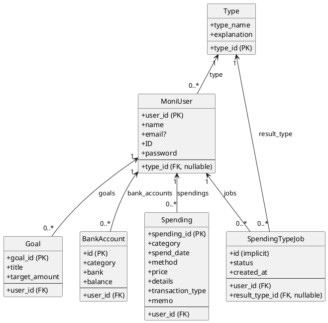
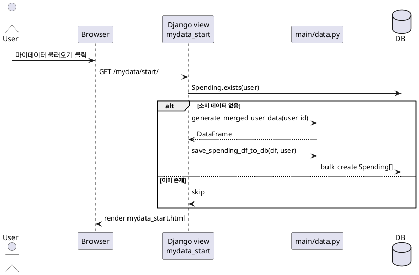

# Moni-master 프로젝트 분석 문서

이 문서는 `Moni-master/` 디렉토리의 소스코드를 기준으로 프로젝트를 요약/분석한 문서입니다.  
다이어그램은 PlantUML(`puml` 코드블록)을 지원하는 뷰어에서 렌더링됩니다.

---

## 1. 프로젝트 개요

- 형태: Django 기반 웹 애플리케이션(서버 렌더링 템플릿 중심)
- 목적(README 기준): 소비·자산 흐름을 통합 분석해 사용자에게 코칭/피드백을 제공하는 “Moni (Money + Monitor)”
- 특징:
  - URL 라우팅은 `moni_project/urls.py`에서 `main` 앱으로 위임
  - 주요 화면은 `templates/`의 HTML을 `main/views.py`에서 렌더링
  - 데이터 모델은 `main/models.py`의 Django ORM 모델로 정의
  - “마이데이터 불러오기” 흐름은 `main/data.py`에서 더미 소비 데이터를 생성해 DB에 적재(프로토타입)

---

## 2. 디렉토리 구조(요약)

```text
Moni-master/
  manage.py
  moni_project/            # Django project (settings/urls/wsgi/asgi)
  main/                    # Django app (views/urls/models/data)
  templates/               # Django templates (home, login 등)
  static/                  # CSS/이미지 등 정적 파일
  db.sqlite3               # 포함되어 있으나 settings는 MySQL 사용
```

---

## 3. 실행 방법(개발 환경 가이드)

프로젝트에 `requirements.txt`가 없어서, 최소 패키지는 아래처럼 추정됩니다.

```bash
pip install django pandas
# MySQL을 실제로 사용한다면 MySQL 드라이버도 필요할 수 있습니다.
# 예: pip install mysqlclient  (또는 pymysql 등)
```

실행(예시):

```bash
python manage.py runserver
```

주의:
- `Moni-master/moni_project/settings.py`는 DB를 MySQL로 설정합니다. 로컬에서 재현하려면 DB 접속 정보/테이블이 준비되어야 합니다.
- `Moni-master/db.sqlite3`가 포함되어 있지만, 현재 설정상 기본 DB로 사용되지 않습니다.

---

## 4. 아키텍처 다이어그램



---

## 5. 핵심 모듈 설명

### 5.1 URL 라우팅

- `Moni-master/moni_project/urls.py`
  - `/admin/` → Django admin
  - `/` → `main.urls`로 include
- `Moni-master/main/urls.py`
  - 홈/소비분석/소비내역/자산/마이페이지/로그인/회원가입 등 화면 라우팅 정의

### 5.2 View(화면) 레이어

- `Moni-master/main/views.py`
  - 서버 렌더링 방식(대부분 `render(request, "<template>.html", context)`)
  - `set_goal`은 `@require_POST`로 목표 설정을 처리
  - `mydata_start`는 소비 데이터가 없으면 `main/data.py`로 더미 데이터를 생성해 `Spending`에 적재

### 5.3 Data 생성(프로토타입)

- `Moni-master/main/data.py`
  - `generate_merged_user_data(user_id)`: 페르소나 기반으로 2024년 1년치 소비/수입 트랜잭션 더미 생성(DataFrame)
  - `save_spending_df_to_db(df, user)`: DataFrame → `Spending` 모델로 변환 후 `bulk_create`

---

## 6. 데이터 모델(클래스 다이어그램)

`Moni-master/main/models.py`에 정의된 모델 기준(일부는 `managed = False`로 외부 DB 테이블을 매핑).



---

## 7. 주요 플로우 다이어그램

### 7.1 “마이데이터 불러오기” 플로우(현재 구현 기준)



---

## 8. API(=URL) 리스트

현재 코드는 “JSON API 서버”라기보다 “웹 페이지 라우팅” 중심입니다. 아래는 `Moni-master/main/urls.py` 기준입니다.

| Path | Methods | View | 결과 |
|---|---|---|---|
| `/admin/` | GET | Django admin | 관리자 페이지 |
| `/` | GET | `home` | `home.html` 렌더링 |
| `/spending-analysis/` | GET | `spending_analysis` | `spending_analysis.html` |
| `/spending-history/` | GET | `spending_history_view` | `spending_history.html` (`?day=` 파라미터 사용) |
| `/spending-type/` | GET | `spending_type` | `spending_type.html` |
| `/assets/` | GET | `asset_detail` | `asset_detail.html` |
| `/mypage/` | GET | `mypage` | `mypage.html` |
| `/profile/edit/` | GET | `profile_edit` | `profile_edit.html` |
| `/goal/set/` | POST | `set_goal` | 목표 저장 후 redirect |
| `/mydata/start/` | GET | `mydata_start` | `mydata_start.html` 렌더링(파일 미존재 시 오류) |
| `/login/` | GET/POST | `login_view` | 로그인 폼/처리 |
| `/signup/` | GET/POST | `signup_view` | 회원가입 폼/처리 |
| `/logout/` | GET | `logout_view` | 로그아웃 후 redirect |

---

## 9. 관찰된 이슈/개선 포인트(코드 기준)

- 설정 하드코딩: `settings.py`에 `SECRET_KEY`, DB 접속 정보 등이 하드코딩되어 있어 운영/공유에 취약합니다(환경변수로 분리 권장).
- DB 구성 불일치: `db.sqlite3`가 포함되어 있으나, 설정은 MySQL을 사용합니다(로컬 재현이 어려울 수 있음).
- 인증/권한: 주요 페이지에 `login_required`가 적용되지 않았고, 일부 로직은 `user_id=1` 고정 사용(프로토타입 흔적).
- 템플릿 누락 가능성: `mydata_start`가 `mydata_start.html`을 렌더링하지만 `templates/`에 해당 파일이 보이지 않습니다.
- 비밀번호 저장: `MoniUser.password`에 평문 저장 형태로 보이며, Django Auth(User)와 이중 사용자 테이블 구조입니다(보안/일관성 점검 필요).
